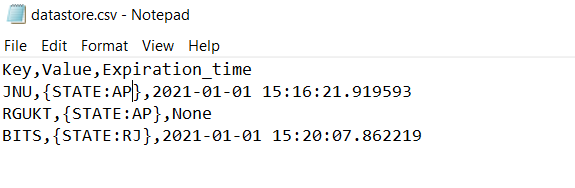

# Key-Value-Datastore
Program that will store and retrieve key-value pairs efficiently from a file.

# How to setup the environment
- Install the libraries that are included in the requirements.txt after successfull installation you are good to go.

# How to run the file
- Enter the command **python main.py** to start running on your machine.By default it will create the file on _C:/Datastore/key-value/_ location unless you mention it
explicity in command line arguments for example **python main.py C:\Users\user\Documents\** creates the file on the given location.

- On linux the default location will be _/root/Datastore/key-value/_

# How to create key_value pairs
- There are two cases for creation of key-value pairs the cases are defined below
# Case 1:Without TTL

# Case 2:With TTL(10 seconds)

# Basic CRD operations

# Contents of datastore.csv

# Features of the datastore

- User can be able to perform CRD operations on key-value pairs
- User can be able to give Time-To-Live in seconds for a key-value pair.
- User can be able to store the data in considerably little memory with more optimized performance.
- User can be able to provide path where the location of datastore will be.
- Supported platforms Linux,Windows
